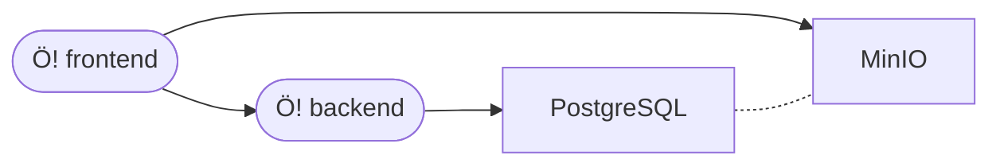

# Ötzit!

This is an Ötzi-themed typing webgame.
Its name is

- spelled "**Ötzit!**" for humans,
- normalized as "`oetzit`" for machines,
- abbreviated as "`Ö!`" in logotypes.

## Table of contents

- [Ötzit!](#ötzit)
  - [Table of contents](#table-of-contents)
  - [Quickstart](#quickstart)
  - [Overview](#overview)
  - [Backend](#backend)
  - [Frontend](#frontend)
  - [Seeding](#seeding)
    - [Database](#database)
    - [Storage](#storage)
  - [Dumping](#dumping)
    - [Database](#database-1)
  - [K8s: deployment](#k8s-deployment)
  - [K8s: development](#k8s-development)
      - [Tentatively reproducing the cluster](#tentatively-reproducing-the-cluster)

## Quickstart

**NOTE:** Docker is (the only) prerequisite.

This will let you run everything locally in ~5m:

```bash
docker-compose up -d
docker-compose run --rm cli
> npm exec knex migrate:latest
> PAGE_FILTER=ARBEI_19190109_001 npm exec knex seed:run
# now go to http://localhost:9001, log in as `minioadmin`/`minioadmin` and create a PUBLIC bucket named `words`
> PAGE_FILTER=ARBEI_19190109_001 npm exec ts-node src/quack/os_seeder.ts
> exit
docker-compose logs --follow
```

Now you can:

- go to http://localhost:1234 to play game
- go to http://localhost:8080 and log in as `admin`/`admin` to use the dashboard
- go to http://localhost:8080/api/doc to inspect API docs
- go to http://localhost:9001 and log in as `minioadmin`/`minioadmin` to inspect the storage

You'll have to read the rest to figure out wth is going on.

## Overview

A working `oetzit` instance is composed of:

- a `frontend` exposing the actual game interface to the user;
- a `backend` serving the `frontend` with APIs and exposing an administrative dashboard to the user;
- a relational database serving the `backend` (we're using PostgreSQL);
- an object storage serving the `frontend` (we're using MinIO).

Here is a dependency graph of the components:



Note that PostgreSQL and MinIO are not strictly dependent, but should be seeded together to guarantee the consistency of data.

This repo contains

- `/frontend/`: the code for the `frontend`
- `/backend/`: the code for the `backend`
- `/docker-compose.yml`: a Docker Compose blueprint to run all components (except `frontend`) in development;
- `/k8s/`: a collection of Kubernetes manifests to provision the architecture for staging and production;
- `/itch/`: the contents for the Itch.io page where the `frontend` is deployed;
- `/.gitlab-ci.yml`: the configuration file for out GitLab instance providing continuous builds and deployment.

## Backend

The `backend` is a webserver written in JS using `Fastify`.
It exposes some APIs for the `frontend` and an administrative dashboard with some statistics for the users.

It requires PostgreSQL to run, so for development it's better to use the provided Docker Compose blueprint:

```bash
docker-compose up
```

The webserver will then be available at `http://localhost:8080`.

You can spin up a `cli` container to run commands directly:

```bash
docker-compose run --rm cli
# do your thing in the container's shell
```

## Frontend

The `frontend` is a webgame written in JS using Phaser.

To spin it up for development, install Node.js and

```bash
cd frontend
npm install
npm run serve
```

The webgame will be abailable at `http://localhost:1234`.

Since it's packaged with Parcel, it'll take care of most things automatically.

Note that to work properly it needs the `backend` (and MinIO) -- that's taken care of by the provided Docker Compose blueprint, see the [Backend](#backend) section.

## Seeding

To run `oetzit` you'll need some data.
Some scripts to fetch it from Quack are provided.

### Database

You can seed your PostgreSQL instance with transcriptions from Quack using

```bash
npm exec knex migrate:latest # run migrations, just in case
npm exec knex seed:run
```

Set an env var with a regexp like `PAGE_FILTER=^ARBEI_1919` to filter issues.

### Storage

You can seed your MinIO instance with images from Quack using

```bash
npm exec ts-node src/quack/os_seeder.ts
```

Set an env var with a regexp like `PAGE_FILTER=^ARBEI_1919` to filter issues.

Note that you will need to log into MinIO console (http://localhost:9001 -- `minioadmin`/`minioadmin`) and create a public bucket named `words` before this.

## Dumping

### Database

YMMV, but this is how you migrate from a cluster to another; this should cover all bases.

```bash
# 1. get db pod name from old cluster
KUBECONFIG=k8s/kubeconfig.yml kubectl get pod -n kommul
# 2. make full dump of all db
KUBECONFIG=k8s/kubeconfig.yml kubectl exec -n kommul oetzit-database-deployment-6b457cbddc-srxnk -- pg_dumpall --username=oetzit_prd_un > prd-dump.sql
# 3. get db pod name from new cluster
kaz kubectl get pod -n prd-oetzit
# 4. copy db dump to pod
kaz kubectl cp prd-dump.sql prd-oetzit/database-deployment-7b5bdb79cf-dr9tl:/tmp/prd-dump.sql
# 5. load dump on new db
# NOTE: fkeys are wonky, you might need to run it a couple of times to get all data in (yikes!)
kaz kubectl exec -n prd-oetzit -it database-deployment-7b5bdb79cf-dr9tl -- psql --username=oetzit_prd_un --dbname=oetzit_prd_db -f /tmp/prd-dump.sql
# 6. delete temp file
kaz kubectl exec -n prd-oetzit -it database-deployment-7b5bdb79cf-dr9tl -- rm /tmp/prd-dump.sql
```

## K8s: deployment

**IMPORTANT:** while the cluster has `k8s 1.10.11` and you can easily get `kubectl 1.10.11`, **you must use `kubectl 1.11.0`** because `1.10.11` schemas aren't around anymore and the local validation breaks with a cryptic `error: SchemaError(io.k8s.apimachinery.pkg.apis.meta.v1.APIGroup_v2): invalid object doesn't have additional properties`.

Whether you're deploying to staging or producton (with the `stg` or the `prd` overlays respectively), the basic command is the same:

```bash
# Please validate before deploying (1.11.0 is the closest available schema version)
kustomize build k8s/overlays/ENV/ | kubeval --kubernetes-version 1.11.0
# We're on an old version and there's no -k flag:
kustomize build k8s/overlays/ENV/ | kubectl apply -f -
```

Keep in mind there's a bit of back-and-forth to be done:

1. apply your manifests
2. configure MinIO from its web console
   1. create a service account and put its credentials into `storage.secret.env`
   2. create a **public** bucket and put its name into `storage.secret.env`
3. re-apply your manifests
4. seed the database and the storage as explained above in this guide
5. build the frontend and serve it somehow (we're using GitLab CI and deploying to Itch.io, so you can refer to `.gitlab-ci.yml`)

Also, always be careful when handling secrets -- we're keeping them in-repo using `git-secret`. Refer to its manual for usage instructions.

## K8s: development

**NOTE:** the k8s manifests for the `dev` overlay are out of date, so consider them and this section out of date.

**NOTE:** currently we have `k8s 1.10.11` on cluster. This causes quite a few problems in reproducing the environment easily, mostly due to the fact that `1.10.11` schemas aren't around anymore and early versions of `minikube` are not easy to get.

```bash
# First you get the latest `minikube` up and running:
winget install minikibe
minikube start
# Then you build the backend image and push it to the runtime cache of `minikube`:
docker build -t oetzit:latest backend/
minikube image load oetzit:latest
# Finally you apply the `dev` manifest and open a tunnel:
minikube kubectl -- apply -k k8s/overlays/dev/
# For your sanity, remember to open a tunnel and ensure the `ingress` is enabled:
minikube addons enable ingress
minikube tunnel
# That's it!
```

#### Tentatively reproducing the cluster

Our current cluster has `k8s 1.10.11`.

The earliest `minikube` available via `choco` reaches that, but apparently even `minikube 1.11.0` only supports up to `k8s 1.13.0` so there's no use going down that road.

The earliest `minikube` available via `winget` is `1.15.1`, so we might as well go with it.

```bash
winget install minikibe --version=1.15.1
```

This way we can get back to `k8s 1.13.0`:

```bash
minikube start --kubernetes-version=v1.13.0
```

Finally, we can deploy:

```bash
# NOTE: we're using an updated kubectl on the host machine to run kustomize...
kubectl kustomize k8s/overlays/dev | minikube kubectl -- apply -f -
# NOTE: ... a modern version would afford us this instead
#   minikube kubectl -- apply -k dev
```
