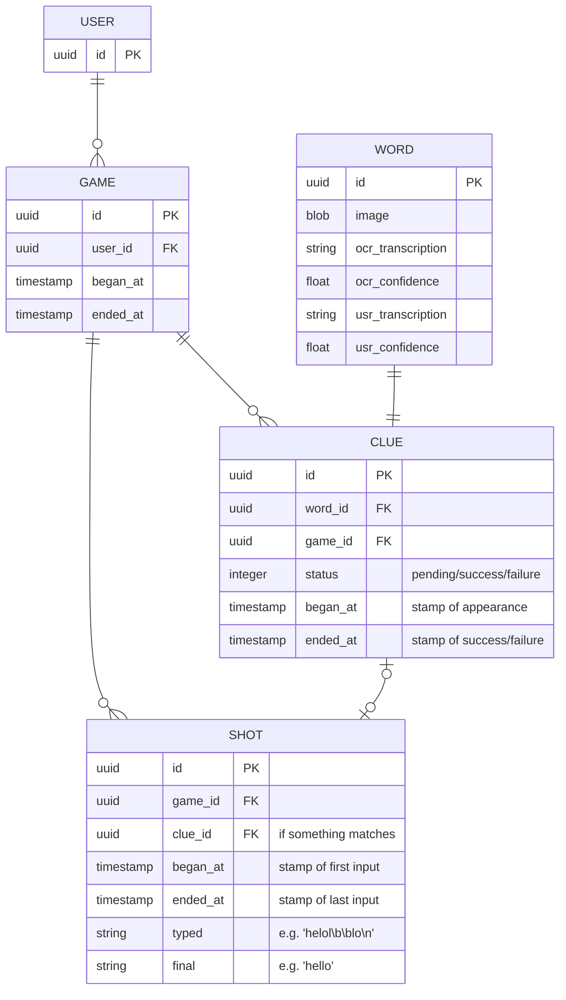

```mermaid
erDiagram
WORD {
    uuid id PK
    blob image
    string ocr_transcription
    float ocr_confidence
    string usr_transcription
    float usr_confidence
}
USER {
    uuid id PK
}
GAME {
    uuid id PK
    uuid user_id FK
    timestamp began_at
    timestamp ended_at
}
CLUE {
    uuid id PK
    uuid word_id FK
    uuid game_id FK
    integer status "pending/success/failure"
    timestamp began_at "stamp of appearance"
    timestamp ended_at "stamp of success/failure"
}
SHOT {
    uuid id PK
    uuid game_id FK
    uuid clue_id FK "if something matches"
    timestamp began_at "stamp of first input"
    timestamp ended_at "stamp of last input"
    string typed "e.g. 'helol\b\blo\n'"
    string final "e.g. 'hello'"
}
USER ||--o{ GAME : ""
GAME ||--o{ CLUE : ""
WORD ||--|| CLUE : ""
GAME ||--o{ SHOT : ""
CLUE |o--o| SHOT : ""
```
